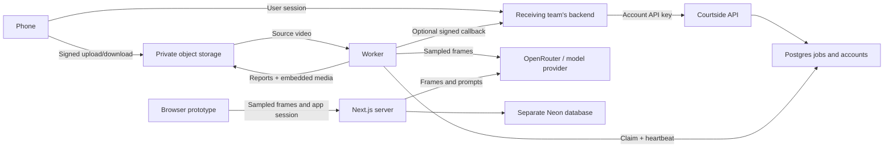

# Courtside repository handoff

This handover includes **the API and worker**, the primary service for app
integration, and **the `cloud/` browser prototype**, including its source, setup,
tests, and development documentation. Both transfer to the receiving team and run
using that team's keys and infrastructure.

Start with [API deployment](api/DEPLOYMENT.md) and give
[the integration contract](api/MOBILE_INTEGRATION.md) to the mobile/backend
engineers. The browser developer follows [the browser setup and acceptance
checklist](cloud/README.md). [Review notes](docs/review.md) record fixes and remaining work.

The standard API setup is **OpenRouter + Qwen3.8 27B**
(`qwen/qwen3.8-27b`). The recipient supplies
`OPENROUTER_API_KEY` alongside their infrastructure credentials; clients can omit
model selection entirely. No locally hosted LLM or GPU is required.
[Default model details](api/README.md#default-llm).

## What is being transferred

| Directory | Responsibility | Runtime |
|---|---|---|
| `courtside/` | Segmentation, frame extraction, model analysis, reports, optional pose | Python 3.11+; deployed image uses Linux/Python 3.12 |
| `api/` | Account keys, signed uploads, Postgres queue, workers, status/results | FastAPI + worker + your Postgres/S3/OpenRouter |
| `cloud/` | Independent browser proof of concept with its own login and database | Next.js + Neon + OpenRouter |
| `examples/` | Sample output for inspecting report format | Static files; review footage rights before redistributing |
| `tests/`, `api/tests/`, `api/integration/` | Pipeline, API regressions, real DB/storage checks | pytest; integration uses disposable services |

For mobile integration, deploy the **API and worker**. Your existing backend must
authenticate app users and send their verified, stable identity as
`X-Courtside-User-Id` with its account key. The API
enforces account/user ownership; your backend optionally provides push delivery.
There is no iOS/Android app, SDK, end-user JWT service, payment integration, or
shared dashboard for API jobs in this handoff.

The included browser prototype is a separate deployment with coach/player login,
teams, browser-side frame extraction, analysis, and saved reports. It calls
OpenRouter directly from its Next.js server and uses a separate Neon database.
It does not call the Python API or share API accounts, jobs, usage accounting, or
deletion operations. Keep its private access gate configured for prototype use;
public-launch work is recorded separately from the handover acceptance checks.

## Receiving-team checklist

- Create your own provider accounts, Postgres database, private bucket, and secrets.
  Choose a region, resource sizes, model, provider budget, and footage/report retention.
- Read the [0.2.0 upgrade and operations runbook](api/OPERATIONS.md), including
  legacy ownership backfill, provider budgets, erasure, and backup restoration.
- Decide how your backend maps app users to accounts/jobs. Keep long-lived credentials
  out of the phone. Implement upload-plan persistence, ETag tracking, polling, and
  signed-report loading using the integration guide.
- Follow either the Fly automation or own-infrastructure Compose runbook. Configure
  HTTPS, edge rate limits, bucket lifecycle, backups, and alerts in your environment.
- Deploy the included browser prototype using [its own runbook](cloud/README.md).
  Supply its Neon connection, server-side OpenRouter key, private access token,
  and exact origin. Complete its coach/player/team/report acceptance checklist
  and assign an owner for the documented prototype limitations.
- Check third-party licensing for your deployment. The default image omits
  Ultralytics code/weights; enabling pose requires an explicit build/runtime opt-in.
  The repository's MIT license does not replace dependency/model terms.
  [Third-party notes](docs/third-party.md).
- Run unit tests, integration tests, and one short **paid** provider smoke run with
  your own keys. Record API URL, release/image digest, configuration owner, support
  owner, backup/restore procedure, and key-rotation procedure in your internal runbook.
- Confirm consent/data disclosures for both paths: the API stores uploaded video
  in your bucket and sends frames to the provider; the browser keeps the source
  video on the device and sends extracted frames through Next.js to the provider.
  Reports and stored thumbnails also need a retention policy.

## Packaging the repository

Private raw videos, downloaded `.pt` weights, virtual environments, `.env` files,
credentials, and generated reports are ignored. They are not required to build;
the image installs its dependencies without local model weights. Only an explicitly
opted-in pose build downloads pose weights.
Transfer a reviewed Git commit or source archive of tracked files, not a ZIP of
the working directory. Include `api/`, `cloud/`, the shared pipeline, and all
documentation, and record the commit ID the receiving team will deploy.
Commit any further reviewed changes before
creating the archive so it contains the intended release.

Preserve `LICENSE`, dependency manifests/lockfiles (including `cloud/package-lock.json`),
API and browser tests, deployment scripts, and environment templates. Exclude
`node_modules/`, `.next/`, and real `.env.local` values. Keep secrets in the receiver's
secret manager. Inventory sample assets separately if you intend to redistribute
those images or reports.

## What “ready” means here

The local build and service contract are testable without the original developer's
keys. The API/worker and browser prototype are both included; their operational
capabilities differ as documented above. There is still a recipient acceptance
step: actual cloud provisioning,
provider/model availability, app authentication, infrastructure configuration, and
paid inference must be verified in that team's environment. This is a deployment
and integration handoff, not a claim that a public consumer service has completed
load testing, privacy review, licensing decisions, or production operations setup.
