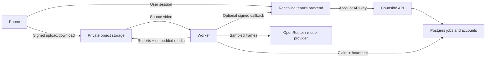

# Courtside repository handoff

This repository provides the analysis service and deployment examples for the
receiving team's infrastructure. Start with [API deployment](api/DEPLOYMENT.md),
then give [the integration contract](api/MOBILE_INTEGRATION.md) to the mobile and
backend engineers. [Review notes](docs/review.md) record fixes and remaining work.

The standard API setup is **OpenRouter + Qwen3.8 27B**
(`qwen/qwen3.8-27b`). The recipient supplies
`OPENROUTER_API_KEY` alongside their infrastructure credentials; clients can omit
model selection entirely. No locally hosted LLM or GPU is required.
[Default model details](api/README.md#default-llm).

## What is being transferred

| Directory | Responsibility | Runtime |
|---|---|---|
| `courtside/` | Segmentation, frame extraction, model analysis, reports, optional pose | Python 3.11+; deployed image uses Linux/Python 3.12 |
| `api/` | Account keys, signed uploads, Postgres queue, workers, status/results | FastAPI + worker + your Postgres/S3/OpenRouter |
| `cloud/` | Independent browser proof of concept with its own login and database | Next.js + Neon + OpenRouter |
| `examples/` | Sample output for inspecting report format | Static files; review footage rights before redistributing |
| `tests/`, `api/tests/`, `api/integration/` | Pipeline, API regressions, real DB/storage checks | pytest; integration uses disposable services |

For a mobile product, deploy the **API and worker**; you do not need the browser
prototype. Account keys grant account-wide access. Your existing app backend must
provide mobile-user authentication, ownership checks, and optionally push delivery.
There is no iOS/Android app, SDK, end-user JWT service, payment integration, or
shared cloud dashboard in this handoff.

## Receiving-team checklist

- Create your own provider accounts, Postgres database, private bucket, and secrets.
  Choose a region, resource sizes, model, provider budget, and footage/report retention.
- Decide how your backend maps app users to accounts/jobs. Keep long-lived credentials
  out of the phone. Implement upload-plan persistence, ETag tracking, polling, and
  signed-report loading using the integration guide.
- Follow either the Fly automation or own-infrastructure Compose runbook. Configure
  HTTPS, edge rate limits, bucket lifecycle, backups, and alerts in your environment.
- Check third-party licensing for your deployment, especially bundled Ultralytics
  code/weights. The repository's MIT license does not replace dependency/model terms.
  [Third-party notes](docs/third-party.md).
- Run unit tests, integration tests, and one short **paid** provider smoke run with
  your own keys. Record API URL, release/image digest, configuration owner, support
  owner, backup/restore procedure, and key-rotation procedure in your internal runbook.
- Confirm app consent/data disclosures reflect the actual flow: full video reaches
  your storage; frames reach the model provider; reports retain images and clips.

## Packaging the repository

Private raw videos, downloaded `.pt` weights, virtual environments, `.env` files,
credentials, and generated reports are ignored. They are not required to build;
the image downloads its own pinned dependency versions and bundled pose weights.
Transfer a reviewed Git commit or source archive of tracked files, not a ZIP of
the working directory. Include the new `api/` and documentation files in that
commit. The current handoff work has deliberately not committed or pushed changes.

Preserve `LICENSE`, the dependency manifests/lockfiles, API tests, deployment
scripts, and all linked docs. Keep real environment values in the receiver's
secret manager. Inventory sample assets separately if you intend to redistribute
those images or reports.

## What “ready” means here

The local build and service contract are testable without the original developer's
keys. There is still a recipient acceptance step: actual cloud provisioning,
provider/model availability, app authentication, infrastructure configuration, and
paid inference must be verified in that team's environment. This is a deployment
and integration handoff, not a claim that a public consumer service has completed
load testing, privacy review, licensing decisions, or production operations setup.
