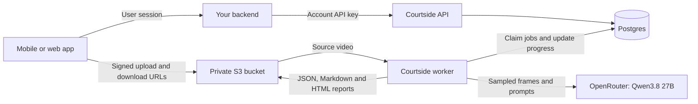

# Courtside

Courtside turns tennis videos into structured stroke/error analysis and reports
for coaches. Deploy its asynchronous API on your infrastructure, then connect
your mobile or web app through your existing backend.

The handover includes **the API and worker as the primary integration service**
and **the `cloud/` browser prototype** for the receiving team to deploy, evaluate,
and develop. The prototype runs independently with its own login and Neon database;
its [setup and acceptance checklist](cloud/README.md) are part of this handover.

**The default model is Qwen3.8 27B through OpenRouter** (`qwen/qwen3.8-27b`).
The API and worker need no GPU or local LLM. You supply your own OpenRouter key,
Postgres database, and private S3-compatible bucket; the local quick start provides
Postgres and MinIO in Docker.

## Choose your starting point

| Goal | Start here |
|---|---|
| Try the API on your computer | [Local API quick start](#local-api-quick-start) |
| Connect an existing app/backend | [Integration overview](#integrate-with-your-app), then the [full API contract](api/MOBILE_INTEGRATION.md) |
| Deploy with your own keys and infrastructure | [Deployment guide](api/DEPLOYMENT.md): Fly.io or your own containers |
| Change or test the Python code | [Developer workflow](#developer-workflow) |
| Run analysis directly on a Mac or through a model endpoint | [Local pipeline and UI guide](docs/local-development.md) |
| Set up the included Next.js browser prototype | [Browser setup and handover checklist](cloud/README.md) |
| Transfer the repository to another team | [Handoff checklist](HANDOFF.md) |

To inspect the output before installing anything, download/open the
[sample HTML report](examples/demo_session/report.html) in a browser.
Its footage and analyses are **illustrative**, not a model-quality benchmark;
see [sample provenance](examples/README.md#provenance-read-this).

## How it fits into your project

Deploy two processes from the same image: the **API** handles accounts, upload
reservations, and job status; the **worker** claims jobs from Postgres, processes
videos, and publishes results. The worker must be a long-lived process with
writable scratch storage. Your app can use the HTTP API from any language.



Your backend owns user login, notifications, and any billing. Keep account keys
on that backend and send `X-Courtside-User-Id`, derived from its verified session,
on each API request. Courtside scopes jobs to that account and user ID. The header
is delegated identity, not proof of login; never copy it from an untrusted phone
request. Return only the authorized job information and short-lived storage URLs.

The phone uploads the full video directly to your bucket. The worker sends sampled
JPEG frames and prompts to OpenRouter and its inference provider. Reports can
embed identifiable frames and short clips. Configure retention for both sources
and results as described in [deployment operations](api/DEPLOYMENT.md#storage-and-retention).

## Local API quick start

Prerequisites: a clone of this repository, Docker with Compose v2, Bash, curl,
Python 3 for the smoke script, and an OpenRouter key with credits/model access
and a finite spending limit. Worker startup verifies that provider-side limit.
Use a short MP4 you have permission to process. All commands below start from the
repository root; no Python package installation is needed for this Docker path.

### 1. Start the services

Run in Bash and leave this terminal open:

```bash
read -r -s -p 'OpenRouter API key: ' OPENROUTER_API_KEY; echo
export OPENROUTER_API_KEY
docker compose -f api/docker-compose.yml up --build
```

The first build downloads video-processing dependencies. Pose libraries/weights
are omitted by default; Qwen runs remotely. The local stack reads the exported key; it does **not** automatically
load `api/.env`. A worker with no key exits with an error.

In a second terminal, from the repository root, wait for readiness to return 200:

```bash
curl --fail http://localhost:8080/readyz
```

Open [interactive API docs](http://localhost:8080/docs) to explore the endpoints.
Readiness checks Postgres and storage; the analysis smoke test below checks the
worker and model provider.

### 2. Create an account and save its key

```bash
curl --fail-with-body http://localhost:8080/v1/admin/accounts \
  -H 'X-Admin-Token: local-admin-token' \
  -H 'Content-Type: application/json' \
  -d '{"name":"Integration test"}'
```

The JSON response contains `account_id`, `key_id`, and `api_key`. Save the IDs for
administration and revocation; the plaintext `api_key` is returned only once.
In the second terminal, set that account key for the smoke script:

```bash
read -r -s -p 'Courtside account API key: ' COURTSIDE_API_KEY; echo
export COURTSIDE_API_KEY
```

`OPENROUTER_API_KEY` pays for model calls and belongs to the service operator.
`COURTSIDE_API_KEY` authenticates your backend to Courtside. They are different keys.
The admin token shown above is for this local demo only.

### 3. Test upload, then analysis

Replace `test.mp4` with the path to your short test video:

```bash
# Upload, complete multipart upload, then cancel; no model calls.
python3 api/scripts/smoke.py test.mp4

# Analyze one clip and verify the generated artifact downloads; uses provider credits.
python3 api/scripts/smoke.py test.mp4 --analyze
```

The second command should finish with `Analysis and artifact downloads passed.`
It disables pose/moment generation for this initial check. For another deployment,
add `--base-url https://your-api.example` and use an account key from that deployment.

### 4. Stop or troubleshoot

`docker compose -f api/docker-compose.yml down` stops the stack and preserves its
named volumes. Adding `-v` deletes local database, object-store, and scratch data.

| Symptom | Check |
|---|---|
| Readiness fails | `docker compose -f api/docker-compose.yml logs api postgres minio createbucket` |
| Job stays queued or the worker exits | `docker compose -f api/docker-compose.yml logs worker`; confirm the key was exported in the startup terminal |
| Analysis fails | Poll the job for `error_code`, inspect worker logs, and check provider credits/model access |
| A physical phone cannot upload | Local ports bind to loopback. Configure reachable API/storage addresses and `S3_PUBLIC_ENDPOINT_URL`; see [local networking](api/README.md#local-quick-start) |

## Integrate with your app

Backend API requests use `Authorization: Bearer <account-api-key>` and
`X-Courtside-User-Id: <verified-app-user-id>`. Administrative requests use
`X-Admin-Token`. Storage requests use the signed URL's credentials;
**do not forward either API authentication header to storage**.

| Step | Caller and request | Result |
|---|---|---|
| Reserve | Backend: `POST /v1/uploads` with `Idempotency-Key` | Persist `job_id` and return the permitted upload plan to the app |
| Upload | App: `PUT` raw bytes to the signed URL(s) | For multipart, save each part's `ETag` |
| Complete | Backend: `POST /v1/uploads/{job_id}/complete` | Required for multipart only; does not start analysis |
| Start | Backend: `POST /v1/jobs/{job_id}/start` | Returns a queued job immediately |
| Poll | Backend: `GET /v1/jobs/{job_id}` | Status, phase, progress, and an optional ETA |
| Get results | Backend: `GET /v1/jobs/{job_id}/report` | Summary and signed HTML, JSON, and Markdown URLs |
| Cancel | Backend: `POST /v1/jobs/{job_id}/cancel` | Requests cancellation; poll until terminal |
| Export/delete | Backend: `GET /v1/jobs/{job_id}/export` or `DELETE /v1/jobs/{job_id}` | Export before deletion; poll `/v1/deletions/{job_id}` for erasure completion |

For a small integration preview, send this start body:

```json
{"options":{"max_clips":3,"pose":false,"moments":0}}
```

Omit `options.model` to use Qwen3.8 27B. The API records the resolved model in
`options.model` when it queues the job. Operators can change `DEFAULT_MODEL`, and
a backend can select an operator-allowlisted model for one job; see
[model configuration](api/README.md#default-llm). Default analysis options process
the whole video (`max_clips: 0`) with pose disabled and up to six moments, so use
a limited preview while integrating.

Poll every 3–5 seconds in the foreground and back off in the background. Handle
`succeeded`, `failed`, `cancelled`, and `expired` as terminal states. Fetch fresh
report URLs when they expire. Uploads support idempotent reservation, URL refresh,
and multipart recovery. Completed clip checkpoints survive worker retries. Optional
signed webhooks use a durable outbox; deduplicate deliveries and keep polling for
recovery. Follow the [recovery and operations guide](api/OPERATIONS.md).

The [mobile integration contract](api/MOBILE_INTEGRATION.md) covers request bodies,
chunking, errors, retries, WebViews, and webhook verification. Use the checked-in
[OpenAPI schema](api/openapi.json) to generate a client, or fetch `/openapi.json`
from the deployed version. No mobile SDK or end-user authentication service is included.

## Deploy on your infrastructure

Use the [deployment guide](api/DEPLOYMENT.md) for prerequisites, exact commands,
configuration, and acceptance checks:

- **Fly.io:** the supplied script provisions the app/storage/worker volume and uses
  your supplied Postgres database by default. Review the offline `--dry-run` first.
- **Your containers:** supply Postgres, a private S3-compatible bucket, secrets,
  HTTPS routing, and worker scratch; use `api/compose.production.yml` or the same
  image on your container platform.

Start from [the environment template](api/.env.example). Keep provider/storage/admin
secrets in the deployment and account keys in your backend. Configure backups,
bucket lifecycle, user mapping, quotas, and a provider budget, then run the smoke tests through
your public HTTPS endpoint. See the [handoff checklist](HANDOFF.md) and
[remaining production work](docs/review.md#recommended-next-work).

## Developer workflow

From the repository root, use Python 3.11+ and install ffmpeg for video-processing
tests (`brew install ffmpeg` on macOS or `sudo apt-get install ffmpeg` on Debian/Ubuntu).
Then install development dependencies:

```bash
python3.11 -m venv .venv
source .venv/bin/activate
python -m pip install -e '.[dev,server]' -r api/requirements.txt httpx
python -m pytest tests api/tests -q
```

These tests need no real provider key, database, bucket, or local LLM. For the real
Postgres/S3 contract, use the [disposable integration stack](api/DEPLOYMENT.md#local-integration-tests-no-provider-charges).
Use Docker Compose above to run the API and worker; after editing Python source,
rebuild/restart the services with the same `up --build` command.

When changing request/response models or endpoint descriptions, regenerate and
review the checked-in contract:

```bash
python api/scripts/export_openapi.py > api/openapi.json
git diff --check
```

| Directory | What to change here |
|---|---|
| `api/courtside_api/` | HTTP routes, auth, queue, worker, storage, and API configuration |
| `courtside/` | Segmentation, sampled-frame analysis, prompts/schema, and report generation |
| `api/tests/`, `tests/` | API regressions and shared pipeline tests |
| `api/integration/` | Tests against disposable Postgres and S3 services |
| `api/scripts/` | Deployment, container startup, contract export, and smoke testing |
| `cloud/` | Independent Next.js prototype with its own accounts/database; see its [development commands](cloud/README.md#local-development) |

Python dependency ranges are in `pyproject.toml` and `api/requirements.txt`;
container builds also apply `api/constraints.txt`. The browser app has its own
lockfile. CI checks Python tests, the API image, DB/storage integration, and the
browser build/tests. Startup applies checksummed, ordered database migrations.
Read the [upgrade and backup runbook](api/OPERATIONS.md) before updating an existing
deployment: version 0.2.0 adds required delegated user identity and provider budgets.

## Analysis limits and licensing

The current pipeline uses motion-based segmentation and sampled frames. Stroke
counts are estimates; reports may be partial when clips fail. Single-camera pose
measurements are 2D estimates, and the model should not be treated as a source of
physical force, depth, or weight-transfer measurements. Review results with a coach.
Latency, provider charges, and quality depend on footage and options; no comparative
tennis benchmark establishes this default model as the best.

The [architecture comparison](docs/architecture.md) describes a proposed larger
system; dedicated event spotting and its other services are not included here.
The repository uses the [MIT license](LICENSE); third-party code, model weights,
and sample assets have their own terms. Read [third-party notes](docs/third-party.md)
before opting into the separate pose build or distributing third-party components.
