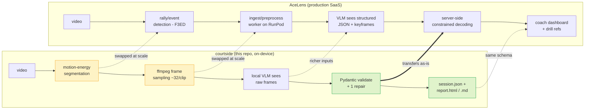

# Architecture: demo vs. production

courtside is a laptop-scale, on-device twin of the AceLens VLM analysis stage. It is
deliberately built so the parts that carry product risk — the structured schema, the
prompts, the monocular-video guardrails, and the eval assets — are **identical** to
production and transfer unchanged. Only the pieces that need scale or specialist models
get swapped.

| stage | courtside (demo) | AceLens (production) | relationship |
|---|---|---|---|
| segmentation | motion-energy heuristic | rally/event detection (F3ED) | **swapped** — a VLM can't count rally events reliably, so production uses a dedicated event-spotting model |
| frame sampling | ffmpeg, ~32 frames/clip | ingest/preprocess worker on RunPod | **swapped** — same idea, scaled infra |
| VLM input | raw sampled frames | structured JSON from the CV stack + keyframes | **enriched** — same model role, better inputs |
| JSON contract | Pydantic validate + 1 repair | server-side constrained decoding | **same schema** — `Rally/Stroke/Error` types are a shared subset |
| output | `session.json` + `report.html`/`.md` | coach dashboard + drill refs | **same schema** — report structure and drill vocabulary transfer |

Why the demo choices are the honest laptop-scale stand-ins: motion energy needs no model
and no labels yet finds active play on fixed-camera footage; ffmpeg does the 4K decode;
and the strict schema means the prompts and eval assets written here run against the
production model with no changes. The guardrails (no depth/force/weight-transfer claims
from monocular video) are enforced in the prompts **and** appended to every report, in the
demo and in production alike.
